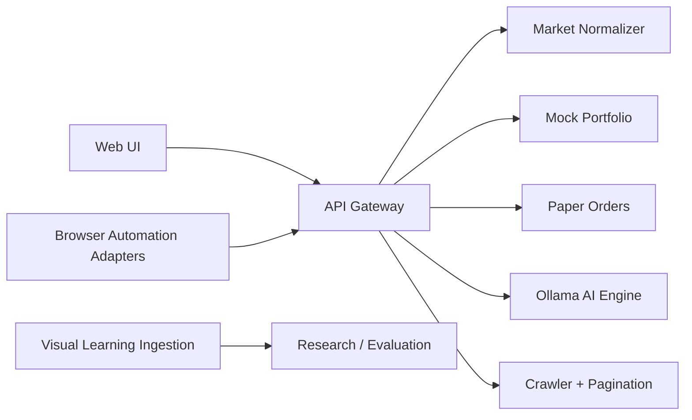

# Veyra Architecture

Veyra is currently a private, local-first prototype. The active runtime is intentionally small so the project can prove correctness before it grows into the wider pre-public roadmap.

## Active Runtime

```text
apps/web
    browser UI for the private foundation

services/api-gateway
    FastAPI entrypoint
    local auth
    database-backed refresh tokens and paper orders
    mock local portfolio

services/market-data
    canonical MarketEvent
    provider normalization starter

services/ai-engine
    Ollama integration boundary

services/crawler
    readable-content extraction
    pagination for research documents

services/browser-automation
    optional adapters for direct-control and agentic browsing

services/visual-learning
    visual observation contracts
    frame ingestion starter
```



## Pre-Public Target

The target architecture is broader, but each workstream stays separate until it has tests, observability, and operating rules.

```text
services/
    auth
    agents
    ai-broker
    execution
    market-data
    portfolio
    alerts
    analytics
    backtesting
    memory
    browser-automation
    crawler
    news
    trading
    mcp-gateway
    visual-learning
    device-hub
    web3-gateway

research/
    model-lab
    quantum-lab
```

## Design Rules

1. Canonical events before provider-specific logic.
2. Paper execution before live execution.
3. Human approval before any irreversible AI action.
4. Classical baselines before quantum claims.
5. Read-only integrations before signing or money movement.
6. Measured experiments before product claims.
7. Archive dormant experiments instead of exposing them as live features.

## Deployment Shape

The local Compose stack is split by responsibility:

- `web`: Vite frontend on port `3000`
- `api`: FastAPI gateway on port `8000`
- `postgres`: active local relational store for refresh tokens and paper orders
- `redis`: future cache and queue
- `qdrant`: future vector store
- `ollama`: optional local model runtime behind the `ai` profile

The current API uses PostgreSQL for refresh tokens, paper orders, and research documents when run through Compose. Portfolio data is still mock-local. Ollama is integrated when reachable; Redis and Qdrant remain infrastructure starters rather than proof that those subsystems already drive product behavior.

## Source Of Truth

- Current-state onboarding: `README.md`
- Private build order: `docs/roadmap/PRIVATE_PHASE_ROADMAP.md`
- Workstream definitions: `docs/architecture/PRE_PUBLIC_WORKSTREAMS.md`
- Gap report: `docs/reports/FOUNDATION_DIAGNOSTIC_REPORT.md`
- Public/local comparison: `docs/reports/LOCAL_VS_ONLINE_GAP_REPORT.md`
