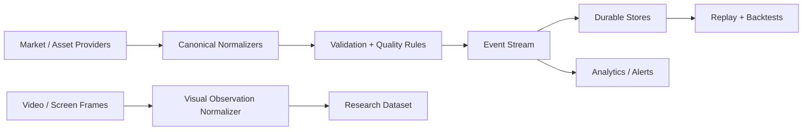

# Data Pipeline Architecture

## Current State

The only active data pipeline implementation today is the canonical market normalization starter in `services/market-data`. The rest of the data platform is roadmap work.

## Target Flow

## Required Canonical Families

- `MarketEvent`
- `CorporateAction`
- `PortfolioSnapshot`
- `OrderEvent`
- `NewsEvent`
- `MacroEvent`
- `VisualObservation`
- `PhysicalAssetObservation`
- `BusinessCashflowEvent`

## Missing Capabilities

- Provider adapters with retries, quotas, and provenance
- Durable storage and migrations
- Event replay
- Idempotency and deduplication
- Licensing controls and source attribution
- Time-zone normalization and clock discipline
- Quality scoring and anomaly detection
- Data lineage for model training and audit

## Domain Expansion

The private roadmap should support multiple wealth domains, but each needs its own source contracts and risk rules:

- public markets
- metals and commodities
- agriculture and food
- property and land
- private businesses
- digital products and content revenue
- holding-company views
- cashflow and liabilities

These domains should converge at analytics and reporting, not at raw ingestion. Their source data, valuation cadence, liquidity, and compliance expectations are different.
