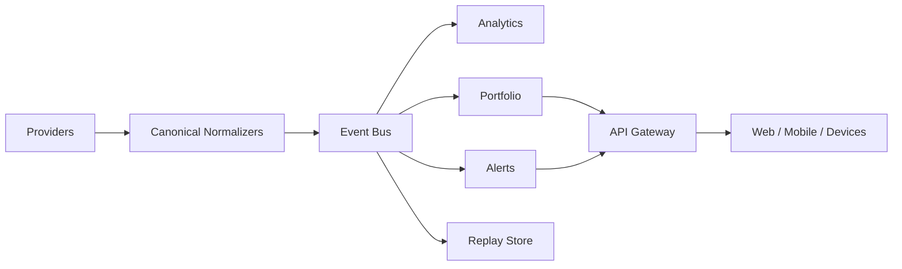

# Event-Driven Architecture

## Current State

No event bus is active in the current runtime. The API returns local mock data and paper-trading records from memory.

## Target

## Implementation Order

1. Canonical schemas and deterministic tests
2. Durable storage with migrations
3. Redis Streams or NATS for local event transport
4. Idempotent consumers
5. Replay tooling
6. WebSocket fan-out
7. Metrics, traces, and dead-letter handling

## Guardrails

- Events are immutable facts.
- Commands and events are separate.
- Consumers must tolerate duplicates.
- Broker execution must have an audit trail independent from the UI.
- Backtests and live flows must share normalization rules but not state.
